# Backend API Architecture & Data Flow

This document details the exact flow of data through the AI Chatbot backend. The architecture is explicitly designed to **keep user data private** while leveraging an external LLM (Gemini) for code and text generation.

## High-Level Sequence Diagram

```mermaid
sequenceDiagram
    participant User as Frontend Client
    participant Upload as /upload Route
    participant Chat as /chat Route
    participant Store as Session Store (LRU Cache)
    participant Compute as Secure Compute Engine
    participant Gemini as Google Gemini 2.5 API

    %% UPLOAD FLOW
    rect rgb(30, 40, 50)
    Note over User, Gemini: PHASE 1: File Upload & Schema Extraction
    User->>Upload: POST /upload (CSV/Excel File)
    Upload->>Compute: Load to Pandas DataFrame
    Compute-->>Upload: Return DataFrame
    Upload->>Compute: Extract Schema (Names & Types)
    Compute-->>Upload: Return Schema Dictionary
    Upload->>Store: Save {session_id: df, schema}
    Store-->>Upload: Acknowledge Save
    Upload-->>User: Return {session_id, schema_info}
    end

    %% CHAT FLOW
    rect rgb(20, 50, 40)
    Note over User, Compute: PHASE 2: Question Answering (Optimized)
    User->>Chat: POST /chat {session_id, question}
    Chat->>Chat: Normalize Query (remove stopwords, punctuation)
    
    Chat->>Store: Check Cache (session_id, normalized_query)
    alt Cache Hit
        Store-->>Chat: Return Cached Result
        Chat-->>User: Return {message, answer, code} (Cached)
    else Cache Miss
        Chat->>Store: Fetch df & schema
        Store-->>Chat: Return df & schema
        
        Chat->>Compute: detect_simple_query(df, norm_query)
        alt Simple Query (e.g. "average age")
            Compute-->>Chat: Direct Pandas Compute (Return raw answer & code)
        else Complex Query
            %% LLM CALL
            Note over Chat, Gemini: Only 1 LLM Call Needed
            Chat->>Gemini: Send Prompt (Schema + Question)
            Gemini-->>Chat: Return Pandas Code
            
            %% SECURE EXECUTION
            Chat->>Compute: Execute Code on df.copy()
            Compute-->>Chat: Return Raw Answer
        end
        
        Chat->>Chat: Generate Local Explanation
        Chat->>Store: Save Result to QueryCache
        Chat-->>User: Return {message, answer, code, error}
    end
    end
```

## Component Breakdown

1. **In-Memory LRU Cache (`utils/session_store.py`)**
   - Stores up to 50 active datasets simultaneously.
   - Prevents Out-Of-Memory (OOM) errors by safely dropping older sessions when usage gets high.
   
2. **LLM Service (`services/llm_service.py`)**
   - **Isolation**: Handles asynchronous (`httpx` / `genai`) network calls.
   - **Double-Pass Logic**: Responsible for both generating code (Pass 1) and translating raw data into natural language (Pass 2).

3. **Secure Compute Engine (`services/compute_service.py`)**
   - **AST Parsing**: Before executing the LLM's code, the engine scans the Abstract Syntax Tree. It instantly blocks any code trying to use `import`, `exec`, or unsafe functions.
   - **Immutability**: Code is run on `df.copy()`. If the LLM writes destructive code (`df.drop(...)`), it only ruins the temporary copy, leaving the original session data safe for the next question.

4. **Privacy-First Prompting (`services/prompt_builder.py`)**
   - Ensures that only column headers (e.g., `"Age"`) and their programmatic data types (e.g., `"int64"`) are sent to Google's servers. 
   - No rows of actual user data are ever serialized or transmitted over the internet.
